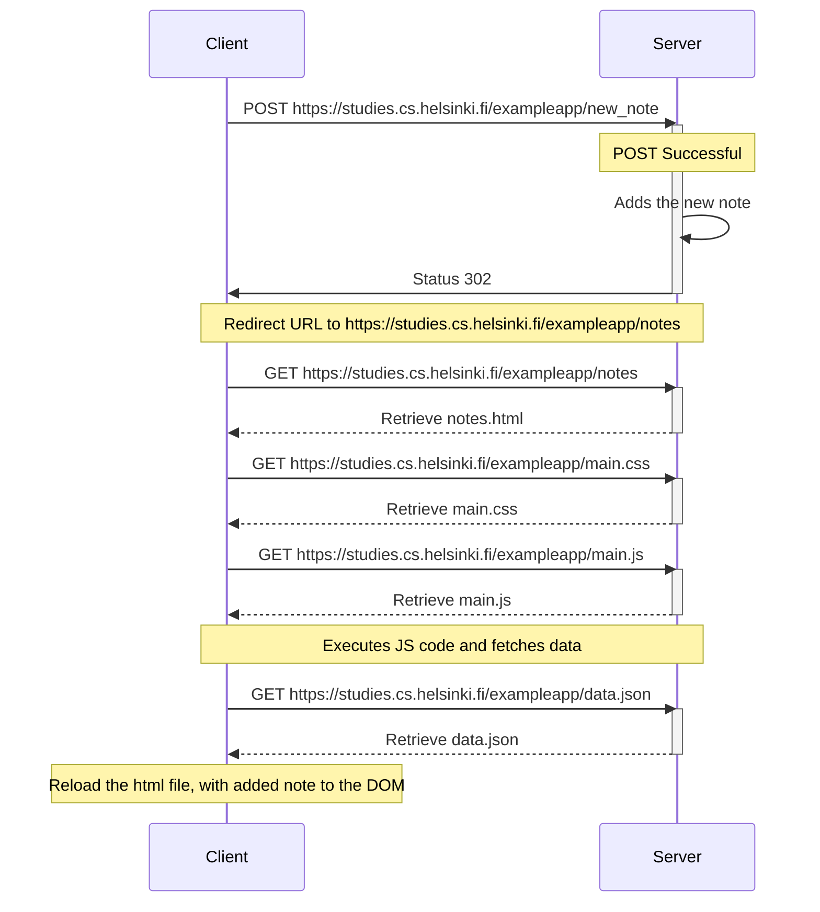

```mermaid
sequenceDiagram
  Client->>Server: POST https://studies.cs.helsinki.fi/exampleapp/new_note
  activate Server
  note over Server: POST Successful
  Server->>Server: Adds the new note
  Server->>Client: Status 302
  deactivate Server
  note over Client, Server: Redirect URL to https://studies.cs.helsinki.fi/exampleapp/notes

  Client->>Server: GET https://studies.cs.helsinki.fi/exampleapp/notes
  activate Server
  Server-->>Client: Retrieve notes.html
  deactivate Server

  Client->>Server: GET https://studies.cs.helsinki.fi/exampleapp/main.css
  activate Server
  Server-->>Client: Retrieve main.css
  deactivate Server

  Client->>Server: GET https://studies.cs.helsinki.fi/exampleapp/main.js
  activate Server
  Server-->>Client: Retrieve main.js
  deactivate Server

  Note over Client, Server: Executes JS code and fetches data

  Client->>Server: GET https://studies.cs.helsinki.fi/exampleapp/data.json
  activate Server
  Server-->>Client: Retrieve data.json
  deactivate Server

  note over Client: Reload the html file, with added note to the DOM
```
