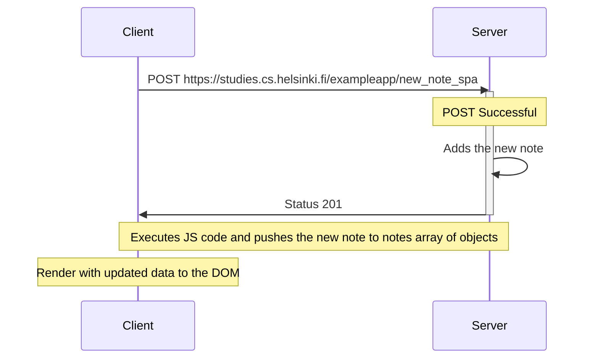

```mermaid
sequenceDiagram
  Client->>Server: POST https://studies.cs.helsinki.fi/exampleapp/new_note_spa
  activate Server
  note over Server: POST Successful
  Server->>Server: Adds the new note
  Server->>Client: Status 201
  deactivate Server

  Note over Client, Server: Executes JS code and pushes the new note to notes array of objects

  note over Client: Render with updated data to the DOM
```
