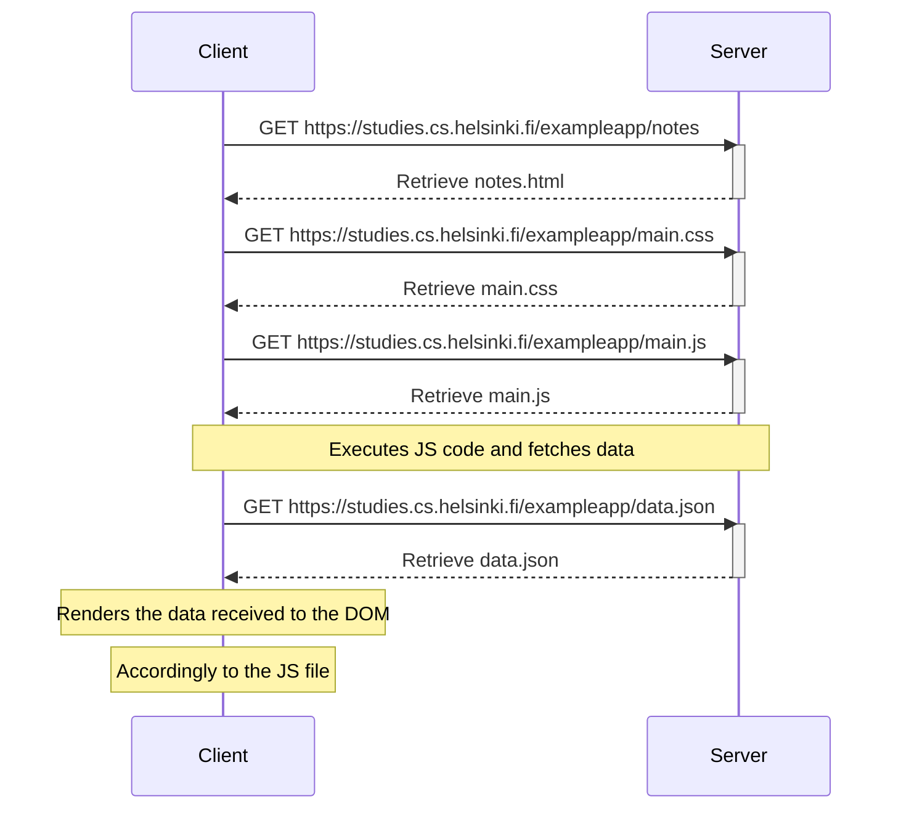

```mermaid
sequenceDiagram
  Client->>Server: GET https://studies.cs.helsinki.fi/exampleapp/notes
  activate Server
  Server-->>Client: Retrieve notes.html
  deactivate Server

  Client->>Server: GET https://studies.cs.helsinki.fi/exampleapp/main.css
  activate Server
  Server-->>Client: Retrieve main.css
  deactivate Server

  Client->>Server: GET https://studies.cs.helsinki.fi/exampleapp/main.js
  activate Server
  Server-->>Client: Retrieve main.js
  deactivate Server

  Note over Client, Server: Executes JS code and fetches data

  Client->>Server: GET https://studies.cs.helsinki.fi/exampleapp/data.json
  activate Server
  Server-->>Client: Retrieve data.json
  deactivate Server

  note over Client: Renders the data received to the DOM
  note over Client: Accordingly to the JS file

```
